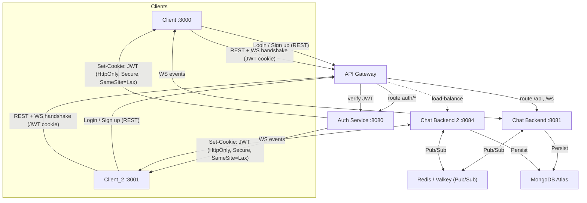
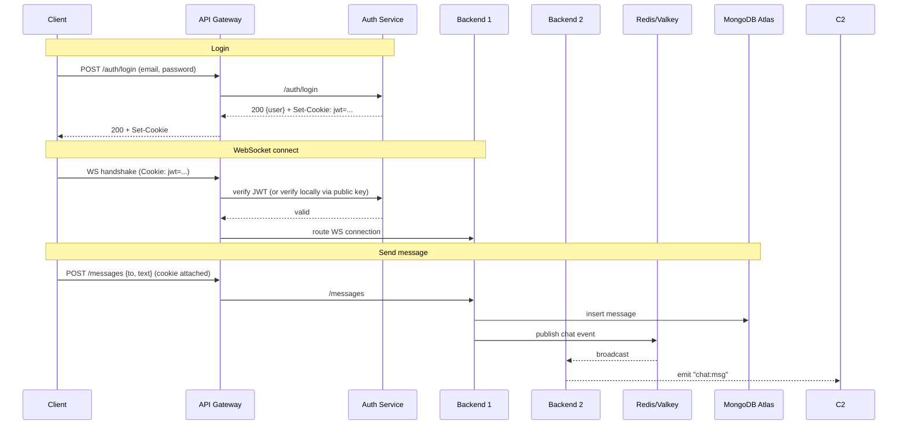

**HLD Chat App**

A **real-time one-to-one messaging application** built with Node.js, Redis Pub/Sub, MongoDB, and WebSockets.
The app uses Docker for containerization and supports horizontal scaling with multiple backend instances.

## 🏗 Architecture

> Notes  
> - **JWT is issued by Auth** and stored as **HttpOnly Secure cookie**.  
> - **API Gateway** verifies JWT (via **Auth** or using a **cached public key**) and routes to **BE1 / BE2**.  
> - **BE1/BE2** exchange chat events via **Redis Pub/Sub** and persist to **MongoDB Atlas**.  
> - WebSocket handshakes include cookies, so the gateway/backends can validate the session.

### 📩 Message Flow
- 1.User connects from the frontend (React/Next.js) to backend over WebSocket & REST.
- 2.Authentication handled by the Auth service issuing JWT tokens.
- 3.Messages are published to Redis channels → consumed by all backend instances for horizontal scalability.
- 4.Persistence: Messages and user data stored in MongoDB Atlas.
- 5.Clients receive real-time updates via WebSocket events.

### 📝 Features
- Real-time messaging using WebSockets
- Redis Pub/Sub for inter-service communication (scale-out support)
- MongoDB for message persistence
- Two front-end clients (client & client_2) for testing horizontal scaling
- Auth microservice for user authentication
- Containerized with Docker & orchestrated with docker-compose
- Deployable on AWS EC2 or ECS

### 🐳 Docker Images
Pre-built images are available on Docker Hub:
| Service   | Docker Hub Image                    |
| --------- | ----------------------------------- |
| Backend 1 | `tarun309/hld-chat-backend:latest`  |
| Backend 2 | `tarun309/hld-chat-backend2:latest` |
| Auth      | `tarun309/hld-chat-auth:latest`     |
| Client 1  | `tarun309/hld-chat-client:latest`   |
| Client 2  | `tarun309/hld-chat-client2:latest`  |

### 🚀 Running Locally with Docker Compose
- #Clone this repository
  - git clone https://github.com/Tarun4541/HLD_chatApp.git
  - cd HLD_chatApp
- #Make sure your .env file exists 
- #Build & run containers
  - docker-compose up --build

**This will start:**
  - Client on http://localhost:3000
  - Client2 on http://localhost:3001
  - Backend on http://localhost:8081
  - Backend2 on http://localhost:8084
  - Auth backend on http://localhost:8080

### 📈 Scaling
  - Multiple backend instances (BE1 & BE2) connected via Redis Pub/Sub for horizontal scaling.
  - JWT authentication handled by a dedicated Auth service.
  - Future enhancement: TLS termination with Nginx/Traefik + Let’s Encrypt.

### SequenceDiagram

