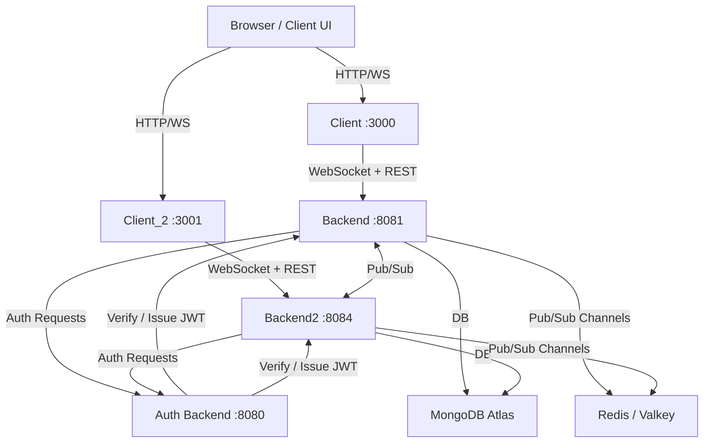

**HLD Chat App**

A real-time one-to-one messaging application built with Node.js, Redis Pub/Sub, MongoDB, and WebSockets.
The app uses Docker for containerization and supports horizontal scaling with multiple backend instances.

## 🏗 Architecture

### Message Flow
**📝 Features**
Real-time messaging using WebSockets
Redis Pub/Sub for inter-service communication (scale-out support)
MongoDB for message persistence
Two front-end clients (client & client_2) for testing horizontal scaling
Auth microservice for user authentication
Containerized with Docker & orchestrated with docker-compose
Deployable on AWS EC2 or ECS

**🐳 Docker Images**
Pre-built images are available on Docker Hub:
| Service   | Docker Hub Image                    |
| --------- | ----------------------------------- |
| Backend 1 | `tarun309/hld-chat-backend:latest`  |
| Backend 2 | `tarun309/hld-chat-backend2:latest` |
| Auth      | `tarun309/hld-chat-auth:latest`     |
| Client 1  | `tarun309/hld-chat-client:latest`   |
| Client 2  | `tarun309/hld-chat-client2:latest`  |

